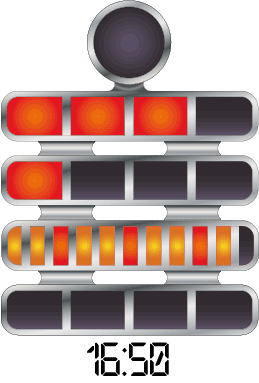

# Coding Dojo

---

### Rules of the Dojo

1. You can't discuss a technique without code
2. You can't show code without tests

 

**Code without tests doesn't exist!**

---

### Roles of the Dojo

1. Sensei: Facilitator/Guide
2. Driver: Person manning the keyboard
3. Navigator: Person who decides what will be typed and what the next action is
4. Advisors: People the navigator can turn to for advice.

---

### Test Driven Development

---

### Writing a Unit Test

A unit test is usually made up of:

1. Arrange
2. Act
3. Assert

We work in the reverse order to convention: first we write the assert, then the act and finally the arrange.

---

### Berlin Clock Kata

[Kata Description](http://agilekatas.co.uk/katas/BerlinClock-Kata)
