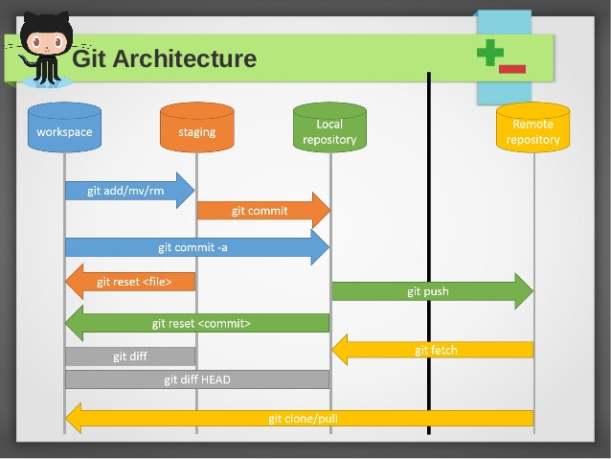

# Git

Git is an advanced version control system.

## Installation

For instructions on installing git, please see the following [page](https://git-scm.com/book/en/v2/Getting-Started-Installing-Git).

## Git Architecture



<dl>
  <dt>Workspace:</dt>
  <dd>Local working folder</dd>
  <dt>Staging:</dt>
  <dd>Local staging area where files are placed that need to be committed into the repository</dd>  
  <dt>Local repository:</dt>
  <dd>Repository close to (usually on) the developer computer</dd>
  <dt>Remote repository:</dt>
  <dd>Repository on a remote server/computer</dd>
</dl>

## Git Commands

### Git Clone

```BASH
git clone [<repository URL>]
```

'Clones' a remote git repository to your local space.

### Git Init

```BASH
git init
```

Sets up a new git repository in the folder from which this command is called.

### Git Config

```BASH
git config [<options>]
```

Sets up configuration settings for the git repository: user name, user email, etc.

### Git Status

```BASH
git status
```

Shows the status of (changed) files in the repository including which files have been staged and which have not been.

### Git Add

```BASH
git add [<path>]
```

'Adds' files to the Staging area, preparing them for a commit.


