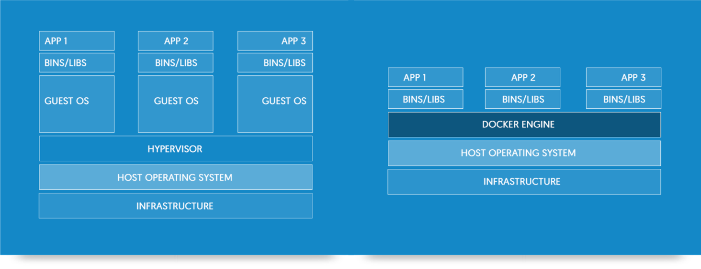
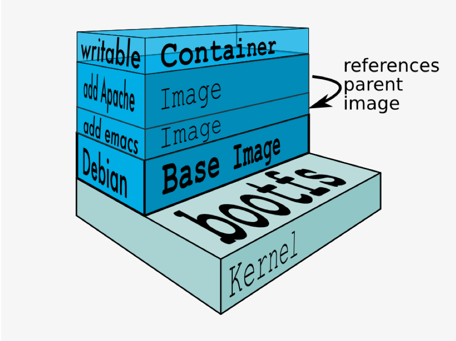
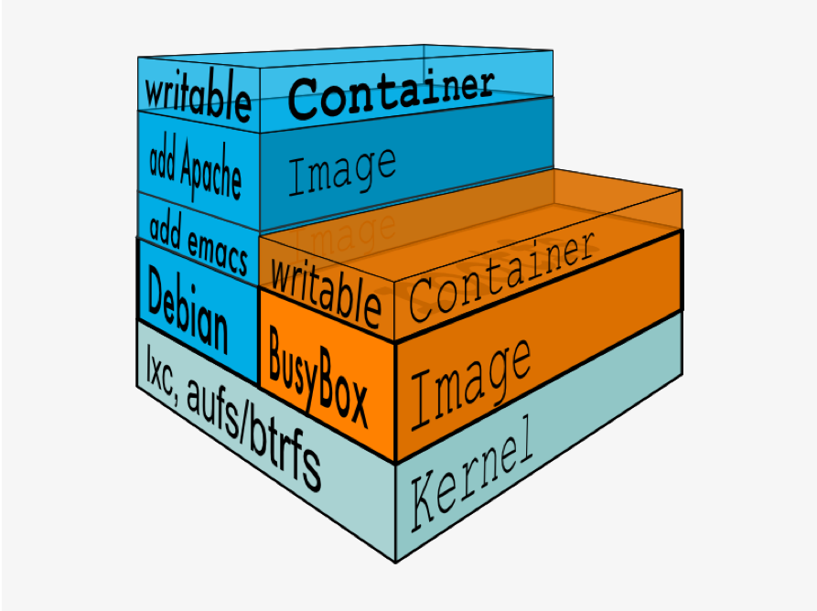

# Docker

### A basic introduction

---

## What?

---

## What?

> "Docker - build, ship and run any app. Anywhere"

---

## What ?

- Develop, ship and run application using virtualisation.
- Abstraction: Wrapping everything that is needed to run it on a server. Code, runtime, system tools, system libraries, config ...
- Ecosystem: whole set of tools, approaches, ...

---

## Virtual machines vs. containers

---

## Containers are like onions

---

## Containers share

